# 📍 InvestAtlas

**A Halal/Shariah-first investment portfolio app for Muslim investors.**

This is a public showcase repository. The production source code is kept private.

## 🔎 What Is InvestAtlas?

InvestAtlas is a web app prototype for Muslim investors who want to understand whether their portfolio is Halal/Shariah-compliant, what may need review, and what purification amount may be needed for impure income portions.

Around that core, it combines portfolio tracking, allocation analytics, country-aware tax awareness, AI-assisted strategy analysis, savings-plan planning, reports, and mobile/desktop portfolio views.

## 🧭 Product Priorities

| Priority | Purpose |
| --- | --- |
| 🕌 Halal / Shariah Compliance | Track what appears compliant, what needs review, and what may be non-compliant for Muslim investors |
| 🧼 Purification / Bereinigung | Estimate impure portions and approximate purification/donation amounts |
| 🤖 AI Strategy Analysis | Explain portfolio structure, momentum, risk, SMA signals, and strategy results through user-owned AI providers |
| 🎯 Savings-Plan Planning | Use budget, allocation, and all-time-high drawdown context to plan more cautious or more aggressive DCA-style buys |

## ✨ Main Highlights

| Feature | Purpose |
| --- | --- |
| 🕌 Shariah Audit | Help Muslim investors review assets through a Halal/Shariah-conscious lens |
| 🧼 Purification | Show approximate purification amounts for non-permissible income portions |
| 📊 Portfolio Dashboard | See total wealth, performance, allocation, and top holdings |
| 💼 Multi-Asset Tracking | Track stocks, ETFs, crypto, metals, and cash-oriented positions |
| 📈 Analytics | Review investments, asset classes, regions, sectors, volatility, and returns |
| 🌍 Tax Awareness | Use a country-aware tax profile so the user can work with their own country assumptions |
| 🧪 Strategy Lab | Explore SMA, Dual-SMA, momentum, Golden Cross, Death Cross, and backtesting concepts |
| 🎯 Crypto Plan | Plan savings/DCA allocation from budget, ATH drawdown, and AI-assisted reasoning |
| 🤖 Ask AI | Connect a user-provided AI provider for optional portfolio, strategy, and savings-plan explanations |
| 📱 Mobile UI | Use core portfolio views from mobile screens |

## 🤖 Ask AI With User-Owned API Keys

InvestAtlas is designed so each user can connect their own AI provider key for AI features.

The app should not depend on one public global AI key in this phase. Each user brings their own key, keeps usage under their own provider account, and can use providers that offer free or free-tier API access.

Possible providers:

| Provider | Good for |
| --- | --- |
| Gemini | Google Gemini API access for general AI explanations |
| Groq | Fast inference with documented free-plan limits |
| OpenRouter | Access to many models, including free model routes where available |

AI features can support portfolio explanations, allocation summaries, risk interpretation, strategy notes, momentum review, SMA crossover interpretation, savings-plan reasoning, and transaction/import assistance. AI output is informational only and must not be treated as financial advice.

## 🚀 How To Start

1. Open the InvestAtlas demo link.
2. Create an account or sign in.
3. Go to **Settings → AI Providers**.
4. Add your own API key from Gemini, Groq, OpenRouter, or another supported provider.
5. Test and save the provider.
6. Use **Ask AI**, **Strategy**, **Crypto Plan**, or AI-assisted import features.

The AI features only work when the user adds their own provider key. InvestAtlas does not include a shared public AI key in this showcase phase.

## 🧪 Strategy And Savings-Plan Intelligence

The Strategy Lab includes SMA and Dual-SMA concepts. A Golden Cross style signal occurs when a shorter moving average crosses above a longer moving average. A Death Cross style signal occurs when a shorter moving average crosses below a longer moving average.

The Crypto Plan / savings-plan area can use budget, selected assets, all-time-high drawdown, and AI-assisted reasoning to suggest whether an asset should receive more cautious allocation near ATH or stronger allocation after a larger drawdown.

## 🖼️ Screenshots

### Product Posters

  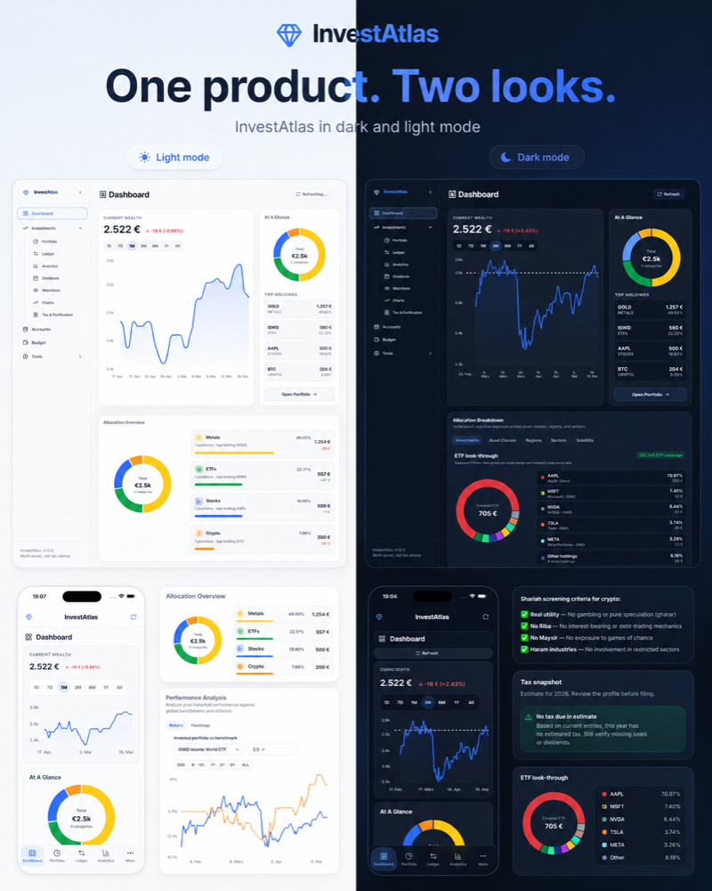

<table>
  <tr>
    <td width="50%">
      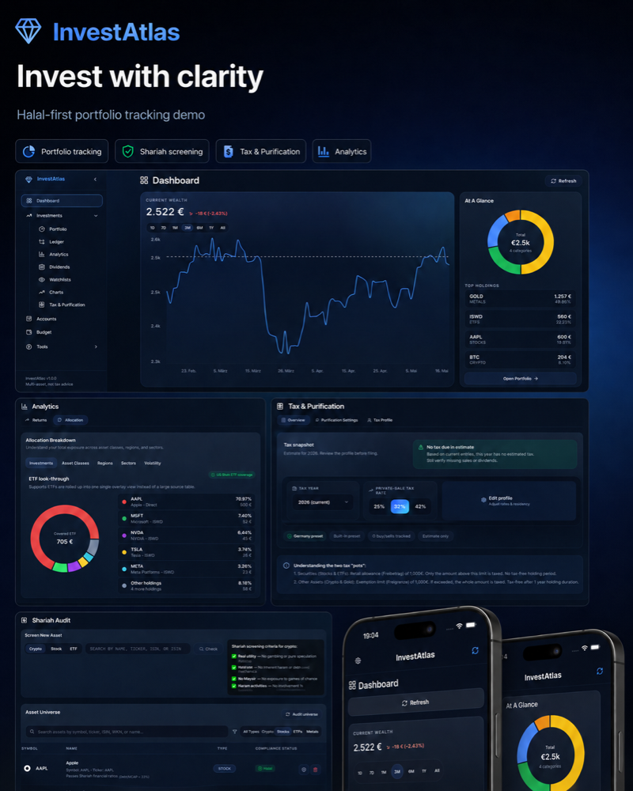
    </td>
    <td width="50%">
      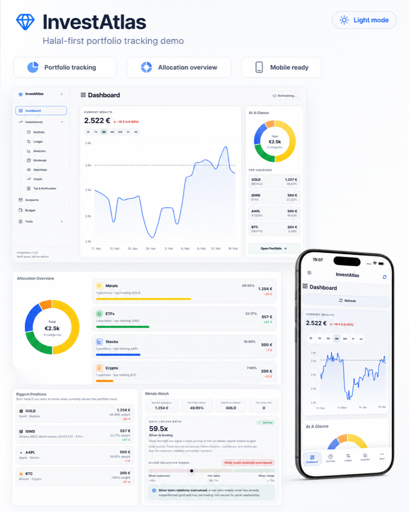
    </td>
  </tr>
  <tr>
    <td align="center"><strong>Dark mode showcase</strong></td>
    <td align="center"><strong>Light mode showcase</strong></td>
  </tr>
</table>

  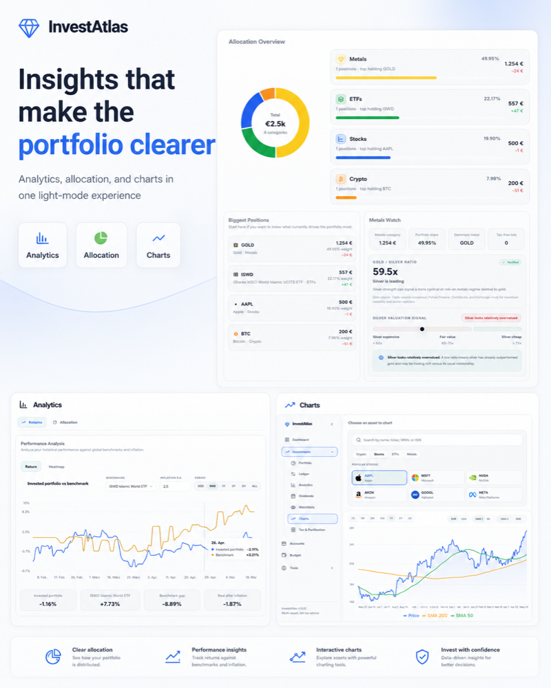

### Dashboard Dark / Light

<table>
  <tr>
    <td width="50%">
      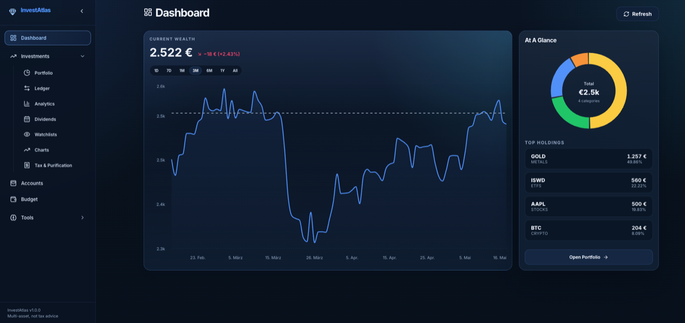
    </td>
    <td width="50%">
      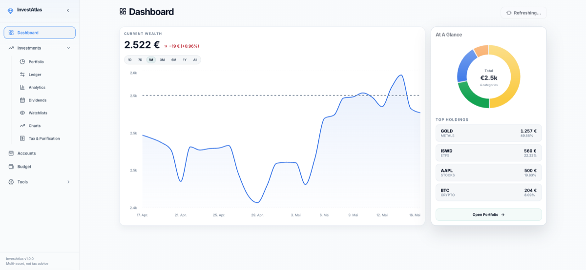
    </td>
  </tr>
  <tr>
    <td align="center"><strong>Dark mode</strong></td>
    <td align="center"><strong>Light mode</strong></td>
  </tr>
</table>

### Halal / Shariah Audit For Muslim Investors

  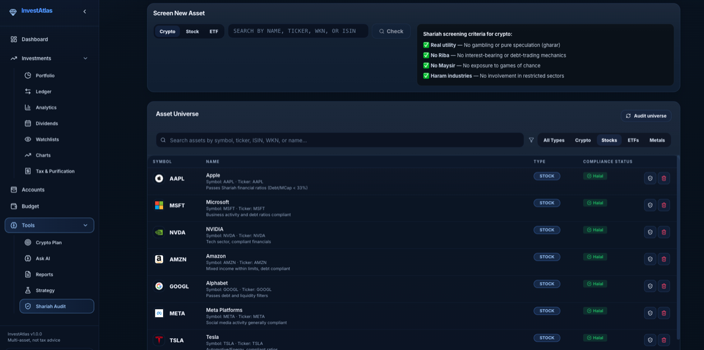

The Shariah audit area is designed for Muslim investors who want clearer visibility into Halal/Shariah-oriented asset screening. It is informational only and does not replace qualified scholarly advice.

### Analytics Allocation

  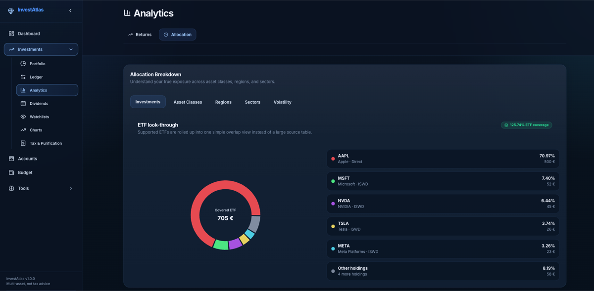

### Tax & Purification

  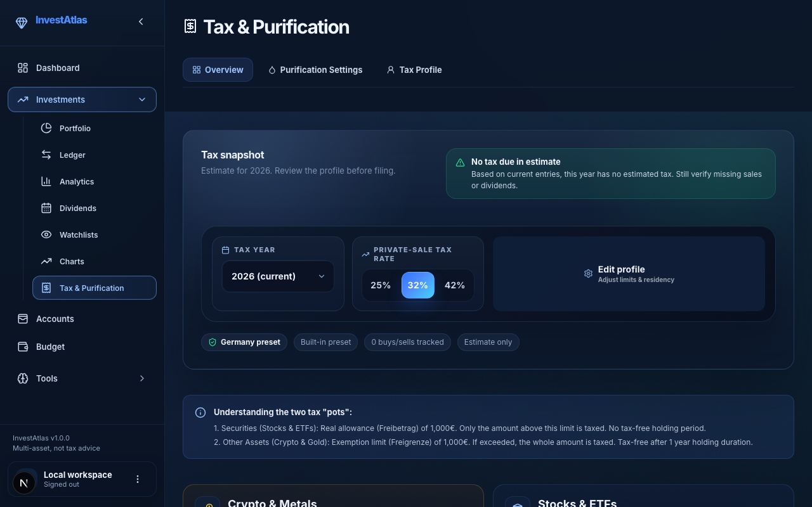

The tax area is positioned as country-aware tax awareness. A user should be able to use their own country/residence assumptions instead of being limited to one country.

### Settings

  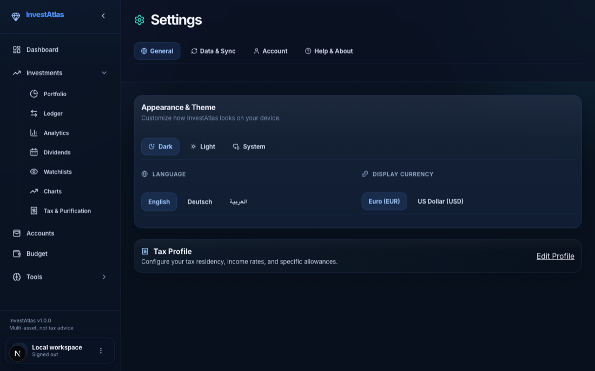

### Mobile Preview

  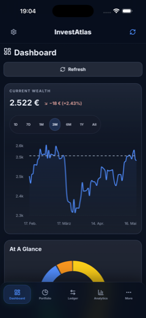
  &nbsp;&nbsp;
  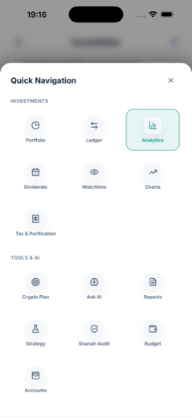

## 🛠️ Tech Stack Overview

The private production app is built with:

- Next.js
- React
- TypeScript
- Tailwind CSS
- Firebase Auth
- Firestore
- Recharts

This public repository intentionally does not include implementation files, build scripts, environment files, API routes, or private configuration.

## 🚀 Demo

Live demo: https://invest-atlas-tan.vercel.app

Hosting note: the web app runs on Vercel. Firebase is used as the backend for authentication and Firestore data.

## 🔒 Repository Scope

Included here:

- Product overview.
- Feature summary.
- Public-safe screenshots.

Not included here:

- Production source code.
- Install or clone instructions for the private app.
- Internal configuration files.
- Environment variables.
- API keys, tokens, or credentials.
- Private user data.
- Private financial data.

## ⚠️ Disclaimer

InvestAtlas is a prototype and portfolio project.

It does not provide financial advice, investment advice, tax advice, legal advice, or religious advice. All calculations, country-specific tax assumptions, Shariah-related checks, Halal screening outputs, analytics, and AI-assisted outputs should be treated as informational only.
