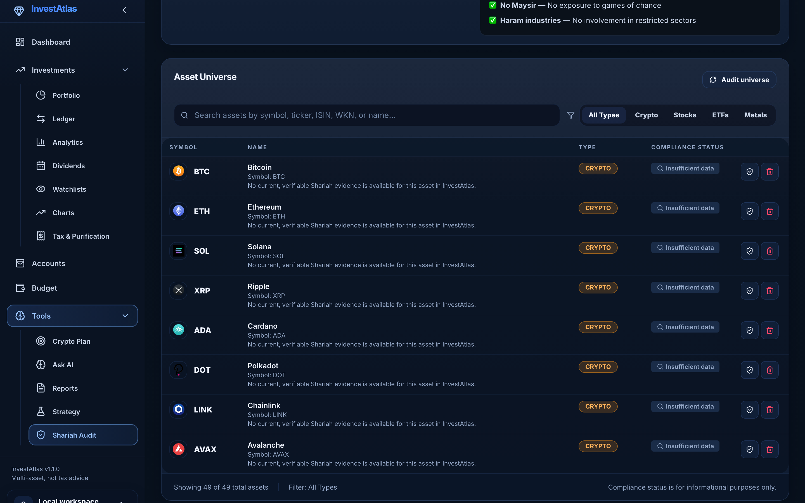
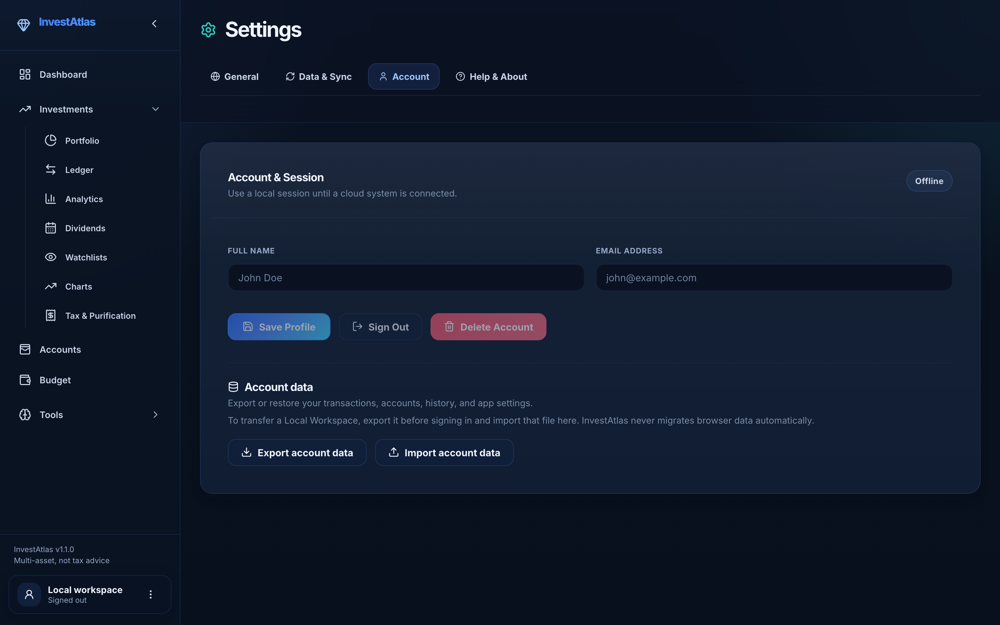
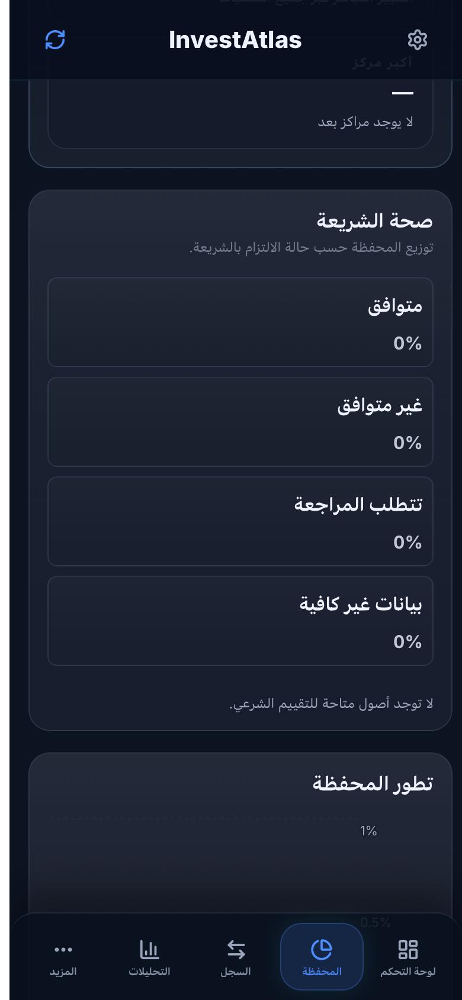

# 📍 InvestAtlas

**A Halal/Shariah-first investment portfolio app for Muslim investors.**

InvestAtlas is a public Demo/Showcase built with production-quality engineering. The production source code remains private; this repository documents the product and its release journey.

## 🔎 What Is InvestAtlas?

InvestAtlas helps Muslim investors understand what a transparent, implemented screening methodology says about their portfolio: compliant, non-compliant, review required, or insufficient data. Missing evidence never becomes a positive result.

Around that trust-first core, the app combines portfolio tracking, allocation analytics, country-aware tax awareness, technical strategy tools, purification support, optional AI interpretation, and bilingual desktop/mobile experiences.

Current public release: **v1.1.0 — Core Integrity**

## 🧭 Product Priorities

| Priority | Purpose |
| --- | --- |
| 🕌 Halal / Shariah Awareness | Distinguish compliant, non-compliant, review-required, and insufficient-data results |
| 🧼 Purification | Calculate only when the required inputs are available; keep known zero separate from missing data |
| 🤖 AI Interpretation | Explain sourced or calculated information through optional user-owned AI providers without inventing fundamentals |
| 🎯 Savings-Plan Planning | Use budget, allocation, and all-time-high drawdown context to plan more cautious or more aggressive DCA-style buys |

## ✨ Main Highlights

| Feature | Purpose |
| --- | --- |
| 🕌 Shariah Audit | Use explicit evidence states and surface uncertainty instead of silently treating missing data as Halal |
| 🧼 Purification | Show a result only when the required financial inputs are known |
| 📊 Portfolio Dashboard | See total wealth, performance, allocation, and top holdings |
| 💼 Multi-Asset Tracking | Track stocks, ETFs, crypto, metals, and cash-oriented positions |
| 📈 Analytics | Review investments, asset classes, regions, sectors, volatility, and returns |
| 🌍 Tax Awareness | Use a country-aware tax profile so the user can work with their own country assumptions |
| 🧪 Strategy Lab | Explore SMA, Dual-SMA, momentum, Golden Cross, Death Cross, and backtesting concepts |
| 🎯 Crypto Plan | Plan savings/DCA allocation from budget, ATH drawdown, and AI-assisted reasoning |
| 🤖 Ask AI | Connect a user-owned AI provider through masked, server-managed key metadata |
| ☁️ Cloud or Local | Use Firebase as the signed-in cloud path or an isolated anonymous Local Workspace |
| 🌐 Bilingual UI | Use English/LTR or Arabic/RTL across desktop and mobile |

## 🤖 Ask AI With User-Owned API Keys

InvestAtlas does not depend on a shared public AI key. A signed-in user can optionally connect a supported provider. Keys are sent to authenticated server routes, stored encrypted in the user's cloud data, and returned to the browser only as masked metadata.

Possible providers:

| Provider | Good for |
| --- | --- |
| Gemini | Google Gemini API access for general AI explanations |
| Groq | Fast inference with documented free-plan limits |
| OpenRouter | Access to many models, including free model routes where available |

AI can explain existing portfolio information, allocation, risk, strategy calculations, momentum, SMA crossovers, and planning context. AI output is interpretation—not sourced financial data—and must not be treated as financial advice.

## 🚀 How To Start

1. Open the InvestAtlas demo link.
2. Create an account or sign in.
3. Go to **Settings → AI Providers**.
4. Add your own API key from a supported provider.
5. Test and save the provider.
6. Use **Ask AI**, **Strategy**, **Crypto Plan**, or AI-assisted import features.

The core portfolio Demo remains usable without an AI key.

## 🧪 Strategy And Savings-Plan Intelligence

The Strategy Lab includes SMA and Dual-SMA concepts. A Golden Cross style signal occurs when a shorter moving average crosses above a longer moving average. A Death Cross style signal occurs when a shorter moving average crosses below a longer moving average.

The Crypto Plan / savings-plan area can use budget, selected assets, all-time-high drawdown, and AI-assisted reasoning to suggest whether an asset should receive more cautious allocation near ATH or stronger allocation after a larger drawdown.

## 🖼️ Screenshots

### v1.1 Shariah Trust States

  

The screening interface exposes unavailable evidence and the implemented methodology's limitations. It does not present an automated result as a fatwa or replace qualified scholarly advice.

### v1.1 Account Data Controls

  

Anonymous Local Workspace data and signed-in Firebase cloud data have an explicit boundary. Moving data is a deliberate export/sign-in/import action rather than a risky automatic migration.

### v1.1 Arabic / RTL on iPhone

  

Arabic is a first-class interface language with RTL layout and explicit Shariah status terminology.

## 🧾 Release History

### v1.1.0 — Core Integrity

- Consolidated authenticated cloud data on Firebase while keeping an isolated anonymous Local Workspace.
- Added deliberate account export/import and safer Local-to-Cloud transfer behavior.
- Made multi-currency calculations fail closed when a trustworthy FX conversion is unavailable.
- Strengthened Firestore ownership rules, API boundaries, security headers, account deletion, and encrypted AI-key handling.
- Corrected Strategy Lab calculations, quote provenance, historical-data parsing, and precious-metal fineness handling.
- Completed synchronized English/Arabic trust and error states plus desktop/mobile validation.

### v1.0.1 — Security & Trust Patch

An internal security milestone completed before v1.1.0 and included in the public v1.1.0 release:

- Closed unsafe mutation, debug, SSRF, path-traversal, runtime-code-generation, and URL-triggered deletion paths.
- Enforced immutable Firestore ownership and removed browser-readable AI-key handling.
- Removed AI-generated fundamentals and replaced Shariah fail-open behavior with explicit uncertainty states.
- Corrected purification missing-versus-zero handling, unsafe FX assumptions, oversell behavior, and partial-data presentation.
- Disabled GA4 for the public Demo.

### v1.0.0 — Public Prototype

Established the original multi-asset portfolio, charts, analytics, Strategy Lab, purification, AI-assisted workflows, bilingual UI, and responsive PWA foundation.

## 🛠️ Tech Stack Overview

The private production app is built with:

- Next.js
- React
- TypeScript
- Tailwind CSS
- Firebase Auth
- Firestore
- Recharts
- Progressive Web App capabilities

This public repository intentionally does not include implementation files, build scripts, environment files, API routes, or private configuration.

## 🚀 Demo

Live demo: https://invest-atlas-tan.vercel.app

Hosting note: the web app runs on Vercel. Firebase is used as the backend for authentication and Firestore data.

## 🔒 Repository Scope

Included here:

- Product overview.
- Feature summary.
- Public-safe screenshots.

Not included here:

- Production source code.
- Install or clone instructions for the private app.
- Internal configuration files.
- Environment variables.
- API keys, tokens, or credentials.
- Private user data.
- Private financial data.

## ⚠️ Disclaimer

InvestAtlas is a public Demo/Showcase and portfolio project, not a broker, paid financial product, or investment-advisory service.

It does not provide financial, investment, tax, legal, or religious advice. Calculations, country-specific tax assumptions, Shariah-related checks, analytics, and AI-assisted interpretations are informational only. Screening states describe the implemented methodology and available evidence—not a binding religious ruling.
