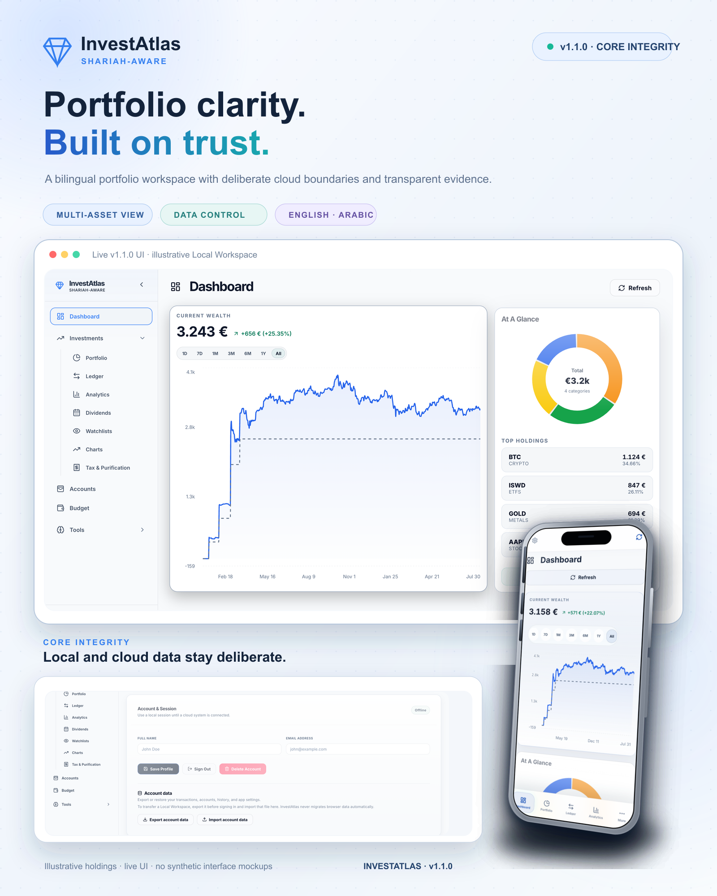
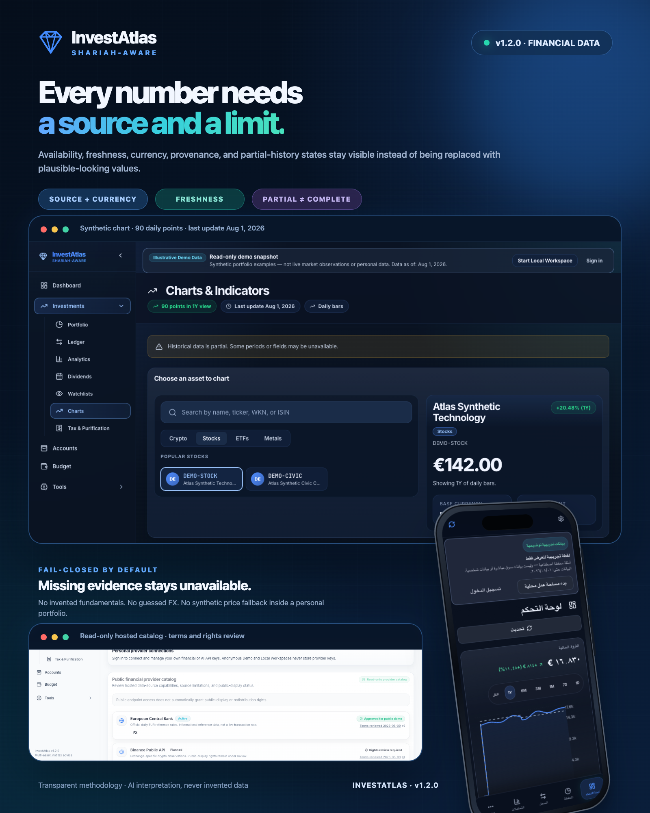
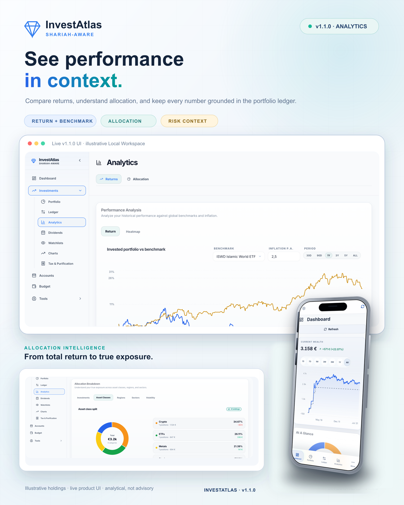
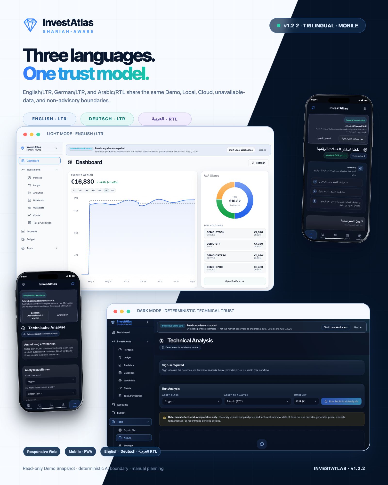

# 📍 InvestAtlas

**A Halal/Shariah-first investment portfolio app for Muslim investors.**

InvestAtlas is a public Demo/Showcase built with production-quality engineering. The production source code remains private; this repository documents the product and its release journey.

## 🔎 What Is InvestAtlas?

InvestAtlas helps Muslim investors understand what a transparent, implemented screening methodology says about their portfolio: compliant, non-compliant, review required, or insufficient data. Missing evidence never becomes a positive result.

Around that trust-first core, the app combines portfolio tracking, sourced asset-class analytics, country-aware tax awareness, technical strategy tools, purification support, optional AI-assisted transaction import, and multilingual desktop/mobile experiences.

Current public release: **v1.2.2 — Trust & Trilingual Baseline**

## 🧭 Product Priorities

| Priority | Purpose |
| --- | --- |
| 🕌 Halal / Shariah Awareness | Distinguish compliant, non-compliant, review-required, and insufficient-data results |
| 🧼 Purification | Calculate only when the required inputs are available; keep known zero separate from missing data |
| 🤖 AI Boundary | Use an optional user-owned provider only for reviewed transaction-document extraction; AI never supplies missing fundamentals or market data |
| 🎯 Savings-Plan Planning | Build recurring contribution scenarios with manual target allocations and transparent source availability |

## ✨ Main Highlights

| Feature | Purpose |
| --- | --- |
| 🕌 Shariah Audit | Use explicit evidence states and surface uncertainty instead of silently treating missing data as Halal |
| 🧼 Purification | Show a result only when the required financial inputs are known |
| 📊 Portfolio Dashboard | See total wealth, performance, allocation, and top holdings |
| 💼 Multi-Asset Tracking | Track stocks, ETFs, crypto, metals, and cash-oriented positions |
| 📈 Analytics | Review investments, sourced asset-class allocation, performance, and data coverage without unsourced look-through heuristics |
| 🌍 Tax Awareness | Use a country-aware tax profile so the user can work with their own country assumptions |
| 🧪 Strategy Lab | Explore SMA, Dual-SMA, momentum, Golden Cross, Death Cross, and backtesting concepts |
| 🎯 Crypto Plan | Plan savings/DCA allocation manually from budget and explicit target percentages |
| 🤖 Optional AI Import | Connect a user-owned provider through masked, server-managed key metadata for reviewed transaction-document extraction |
| 🧭 Demo Snapshot | Explore a dated, read-only synthetic portfolio that never enters personal calculations |
| 🔎 Financial Data Trust | Keep source, currency, freshness, calculation, partial-data, and unavailable states visible |
| ☁️ Demo, Local, or Cloud | Use the isolated showcase, an editable browser workspace, or Firebase as the signed-in cloud path |
| 🌐 Multilingual UI | Use English/LTR, selectable German/LTR, or Arabic/RTL; broader German linguistic QA remains ongoing |

## 🤖 Optional AI Providers

InvestAtlas does not depend on a shared public AI key. A signed-in user can optionally connect a supported provider. Keys are sent to authenticated server routes, stored encrypted in the user's cloud data, and returned to the browser only as masked metadata.

Possible providers:

| Provider | v1.2.2 support |
| --- | --- |
| Gemini | Transaction-document import through fixed Google Gemini endpoints |
| Groq | Transaction-document import through fixed Groq endpoints |
| OpenRouter | Transaction-document import through fixed OpenRouter endpoints |
| OpenAI | Transaction-document import through fixed OpenAI endpoints, with optional organization/project metadata |

In v1.2.2, AI is limited to a user-initiated transaction-document import proposal. The document is sent only to the highest-priority enabled provider and is never automatically forwarded to a fallback provider. The user must review the extracted rows before applying them. Technical Analysis is deterministic and local; AI does not provide market prices, fundamentals, portfolio recommendations, or Savings-Plan allocations. Arbitrary custom AI URLs remain disabled; supported providers use fixed, server-controlled endpoints.

## 🚀 How To Start

1. Open the InvestAtlas demo link.
2. Review and accept the linked Demo terms, privacy information, and financial-data limitations.
3. Explore the read-only **Demo Snapshot**, or start a separate editable **Local Workspace**.
4. Sign in only when you want a Firebase-backed personal workspace or optional AI-assisted transaction import.
5. Add a supported user-owned AI key in Settings only if you want reviewed transaction-document import.

The core Demo remains usable without an account, AI key, or financial-data key.

## 🧭 Financial Data Transparency

v1.2 introduces a field-level trust model for availability, source, currency, freshness, observation date, and calculated values. Missing information remains unavailable instead of being replaced with a plausible estimate.

The public hosted release intentionally activates only official European Central Bank reference FX. Shared stock and crypto quote/history providers remain disabled while display, proxy, permission, or redistribution rights are unresolved. A Tiingo BYOK adapter exists for local engineering, but hosted connection and market-data display remain disabled pending written rights clarification. The signed-out Demo Snapshot stays useful through clearly labelled, dated synthetic examples that are isolated from personal data.

## 🧪 Strategy And Manual Savings-Plan Tools

The Strategy Lab includes SMA and Dual-SMA concepts. A Golden Cross style signal occurs when a shorter moving average crosses above a longer moving average. A Death Cross style signal occurs when a shorter moving average crosses below a longer moving average.

The Crypto Plan / savings-plan area keeps allocation decisions manual. It can show source availability and planning context, but it does not generate or apply AI portfolio allocations.

## 🖼️ Screenshots

### v1.2.2 Product-Truth Overview

  

### v1.2.2 Technical-Analysis Trust & Dark Mode

  

The screening interface exposes unavailable evidence and the implemented methodology's limitations. It does not present an automated result as a fatwa or replace qualified scholarly advice.

### v1.2.2 Sourced Analytics & Performance

  

### Light, Dark & Multilingual UI

  

The poster set uses the current v1.2.2 Production UI, read-only Demo Snapshot, and real hosted-provider policy. All holdings and charts shown are synthetic and dated. English/LTR, German/LTR, and Arabic/RTL are shown directly across the reviewed set.

## 🧾 Release History

### v1.2.2 — Trust & Trilingual Baseline

- Replaced action-oriented AI verdicts with deterministic, non-advisory technical posture and removed provider-generated analysis prose.
- Disabled AI-generated Savings-Plan allocations while preserving manual planning workflows.
- Limited transaction-document import to one highest-priority enabled AI provider, with explicit user review and no automatic fallback forwarding.
- Removed unsourced ETF look-through, region/sector allocation, and heuristic volatility from personal Analytics.
- Reframed gold/silver as a neutral same-date calculated ratio with non-predictive reference bands.
- Added complete German legal bodies and focused English/German/Arabic desktop/mobile QA, including Arabic RTL and accessible mobile navigation.
- Made quote refresh visibility-aware, overlap-safe, and resistant to stale-request races; optimized a representative 365-day portfolio-monitor benchmark by roughly 21×.
- Added shared route loading/error/not-found states and refreshed the four-poster set with real v1.2.2 UI and polished dimensional iPhone frames.

### v1.2.1 — Provider Truth & AI Key UX Patch

- Replaced an impossible hosted financial-provider Connect prompt with honest, runtime-aware availability guidance.
- Distinguished active, local-engineering-only, and disabled provider states; hosted stock and crypto prices remain unavailable rather than being guessed.
- Clarified optional personal AI-key support for OpenAI, Gemini, Groq, and OpenRouter through fixed server-controlled provider endpoints.
- Removed dormant custom URLs from browser-safe metadata and strengthened secret-free logging and route-level SSRF boundaries.
- Added focused English/German/Arabic, RTL, accessibility, Preview, Production, and independent security verification.
- Refreshed the compact four-poster presentation from the real v1.2.1 Production UI without accumulating raw screenshots.

### v1.2.0 — Financial Data Foundation

- Added field-level availability, source, currency, freshness, quality, and provenance contracts.
- Added official ECB EUR/USD reference FX with attribution and fail-closed freshness handling.
- Added a deterministic, dated, read-only synthetic Demo Snapshot, isolated from Local and Firebase workspaces.
- Prevented synthetic Demo values from entering personal P&L, valuation, history, or portfolio calculations.
- Added transparent hosted-provider catalog and English/Arabic Terms, Privacy, and Financial Data Disclaimer surfaces.
- Added an encrypted Financial Provider vault and a locally testable Tiingo BYOK adapter; hosted Tiingo use remains disabled pending written rights clarification.
- Hardened market-data boundaries against redirects, arbitrary hosts, oversized or malformed responses, stale/incomplete history, secret exposure, and cross-user state.
- Completed desktop, Arabic/RTL mobile, iPhone Safari, build, test, dependency, and independent security review.

### v1.1.0 — Core Integrity

- Consolidated authenticated cloud data on Firebase while keeping an isolated anonymous Local Workspace.
- Added deliberate account export/import and safer Local-to-Cloud transfer behavior.
- Made multi-currency calculations fail closed when a trustworthy FX conversion is unavailable.
- Strengthened Firestore ownership rules, API boundaries, security headers, account deletion, and encrypted AI-key handling.
- Corrected Strategy Lab calculations, quote provenance, historical-data parsing, and precious-metal fineness handling.
- Completed synchronized English/Arabic trust and error states plus desktop/mobile validation.

### v1.0.1 — Security & Trust Patch

An internal security milestone completed before v1.1.0 and included in the public v1.1.0 release:

- Closed unsafe mutation, debug, SSRF, path-traversal, runtime-code-generation, and URL-triggered deletion paths.
- Enforced immutable Firestore ownership and removed browser-readable AI-key handling.
- Removed AI-generated fundamentals and replaced Shariah fail-open behavior with explicit uncertainty states.
- Corrected purification missing-versus-zero handling, unsafe FX assumptions, oversell behavior, and partial-data presentation.
- Disabled GA4 for the public Demo.

### v1.0.0 — Public Prototype

Established the original multi-asset portfolio, charts, analytics, Strategy Lab, purification, AI-assisted workflows, bilingual UI, and responsive PWA foundation.

## 🛠️ Tech Stack Overview

The private production app is built with:

- Next.js
- React
- TypeScript
- Tailwind CSS
- Firebase Auth
- Firestore
- Recharts
- Progressive Web App capabilities

This public repository intentionally does not include implementation files, build scripts, environment files, API routes, or private configuration.

## 🚀 Demo

Live demo: https://invest-atlas-tan.vercel.app

Hosting note: the web app runs on Vercel. Firebase is used as the backend for authentication and Firestore data.

## 🔒 Repository Scope

Included here:

- Product overview.
- Feature summary.
- Public-safe screenshots.

Not included here:

- Production source code.
- Install or clone instructions for the private app.
- Internal configuration files.
- Environment variables.
- API keys, tokens, or credentials.
- Private user data.
- Private financial data.

## ⚠️ Disclaimer

InvestAtlas is a public Demo/Showcase and portfolio project, not a broker, paid financial product, or investment-advisory service.

It does not provide financial, investment, tax, legal, or religious advice. Calculations, country-specific tax assumptions, Shariah-related checks, analytics, and AI-assisted transaction-import proposals are informational only. Screening states describe the implemented methodology and available evidence—not a binding religious ruling.
